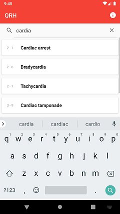

# Quick Reference Handbook (QRH)

 |  | 

## Features
- Unofficial derivative of Association of Anaesthetists Quick Reference Handbook (QRH) www.anaesthetists.org/qrh
- ***Not endorsed by the Association of Anaesthetists***
- Rapidly searchable guideline list
- Simple guideline layout echoing original handbook
- Easily updatable through modification of JSON assets
- [![CC BY-NC-SA 4.0][cc-by-nc-sa-shield]][cc-by-nc-sa] Released under same Creative Commons license as original work

## License
This work is licensed under a [Creative Commons Attribution-NonCommercial-ShareAlike 4.0
International License][cc-by-nc-sa].

[![CC BY-NC-SA 4.0][cc-by-nc-sa-image]][cc-by-nc-sa]

[cc-by-nc-sa]: http://creativecommons.org/licenses/by-nc-sa/4.0/
[cc-by-nc-sa-image]: https://licensebuttons.net/l/by-nc-sa/4.0/88x31.png
[cc-by-nc-sa-shield]: https://img.shields.io/badge/License-CC%20BY--NC%20SA%204.0-lightgrey.svg

You may distribute original version or adapt for yourself and distribute with acknowledgement of source. 
You may not use for commercial purposes.

## Download

Please download Version 1 Release Candidate 1 from here:
https://github.com/mttrnd/qrh/releases/tag/v1.0rc1

## Technical

The guideline list is generated from /assets/guidelines.json. 

Guidelines are stored as JSON objects in the assets folder.

Each array contains 'type', 'main', 'sub' and 'step' keys.

Type integer value determines the appearance of the generated card:
1. Introductory text (main only)
2. START text (main only)
3. Guideline step with bold heading and separate content (main, sub and step)
4. Guideline step with single text field (main and step)
5. Orange expanding box (main and sub)
6. Blue expanding box (main and sub)
7. Green expanding box (main and sub)
8. Black expanding box (main and sub)
9. Purple expanding box (main and sub)
10. Image (path/URL in main, caption in sub)
11. Version text (main only)
12. Red disclaimer card (main only)

Basic HTML tags (B, U, I, LI) can be used within these for formatting where required. Unicode subscript and superscript characters are used rather than SUB and SUP spans.
## Todo
- [x] Populate data
- [x] Collapsing cards for boxes
- [x] Section 0-4 (locations)
- [X] 1st release candidate
- [ ] 1st stable release
- [ ] Streamline architecture
- [ ] Tablet layout
## Accompanying Guidance & Disclaimers

### 1. 
This application is an unofficial adaptation of the Association of Anaesthetists Quick Reference Handbook (QRH); a collection of guidelines for unexpected or uncommon anaesthesia-related emergencies. It is not endorsed by the Association of Anaesthetists. As per the original accompanying guidance:

*"The QRH is not a substitute for learning and practising clinical skills. Nor is it a substitute for being familiar with more detailed guidelines and algorithms, such as those for managing cardiac arrest or difficult airway. It's essential that clinicians learn about these and practice their implementation elsewhere. For example, it's expected that in using the QRH guideline for managing cardiac arrest, clinicians will already have underlying knowledge of conditions causing cardiac arrest and will be competent in providing advanced life support.*

*The QRH is also not intended to be used as a rule book every single time one of the guideline situations is encountered. For instance, most ordinary occasions of hypotension will have a simple cause and will respond to obvious remedies. The hypotension guideline becomes useful if the situation is out of the ordinary or becomes unremitting. Conversely, for the more immediate and uncommon problems, such as cardiac arrest in theatre, the guideline should be used from the outset to help avoid missing out useful steps in resolving the situation."*

The guidelines in this handbook are not intended to be standards of medical care. The ultimate judgement with regard to a particular clinical procedure or treatment plan must be made by the clinician in the light of the clinical data presented and the diagnostic and treatment options available.

### 2. 
This application is intended only for use by healthcare professionals practising in the United Kingdom who are already familiar with the QRH. At the time of release, this app would not be considered a medical device in the United Kingdom, insofar that it only provides reference information to help a healthcare professional use their knowledge to make a clinical decision. According to the Medicines and Healthcare products Regulatory Agency guidance "Medical device stand-alone software including apps" (Last updated 4th June 2020); software is unlikely to be a device if it just reproduces a paper document in digital format, provides information to follow the path of a procedure/treatment, or it has decision points but the healthcare professional decides which path to take.

Regulations may change with time. Active distribution by the developer will be ceased if this application subsequently becomes subject to regulatory approval. Due to the offline and open-source nature of the application, however, the developer cannot be held responsible for ongoing use and distribution of the application or its source code by other parties beyond this time. Please periodically check whether regulations have changed. 

For more information please see: https://www.gov.uk/government/publications/medical-devices-software-applications-apps

### 3. 
This application reproduces the August 2019 version of the QRH, adapted to fit the mobile application format. Content has largely been transcribed verbatim, except for minor formatting, punctuation and structure tweaks that do not meaningfully alter the guidelines, and the introduction of TALLman Lettering to improve the readability of certain words. The developer assumes no responsibility or liability for any errors or omissions in the content. The information is provided on an "as is" basis with no guarantees of completeness, accuracy, usefulness or timeliness. Likewise, the application is provided on an "as is" basis with no guarantees of usefulness, performance or reliability. The developer, original QRH authors, or anyone else connected in any way with the QRH or application, cannot be held responsible for your use of the information contained in or linked from this application.

The QRH is updated from time to time. A version number is displayed next to each guideline in the list view, and at the bottom of each guideline when opened; these correspond with the Association of Anaesthetist guideline versioning. You must check that the guidelines you are using are up to date. The developer will endeavour to keep the application updated with any new QRH revision, but there will be a delay between release from the Association of Anaesthetists and release of an application update. If any guidelines contained within the application become superseded, please revert to using the latest version from the Association of Anaesthetists. Alternatively, the source code could be obtained from github.com/mttrnd/qrh and updated by the end-user. 

This application allows you to set short reminders for locations of emergency equipment. Please do not use this function to store any personal, sensitive or patient-related data. No data is transmitted by this application itself, however, data stored by the application my be automatically backed up by the Android operating system (including transmission over the internet) or accessed by other applications. If you wish to clear any data stored with the application, please click the 'RESET DATA &amp; EXIT' button on the About page.
