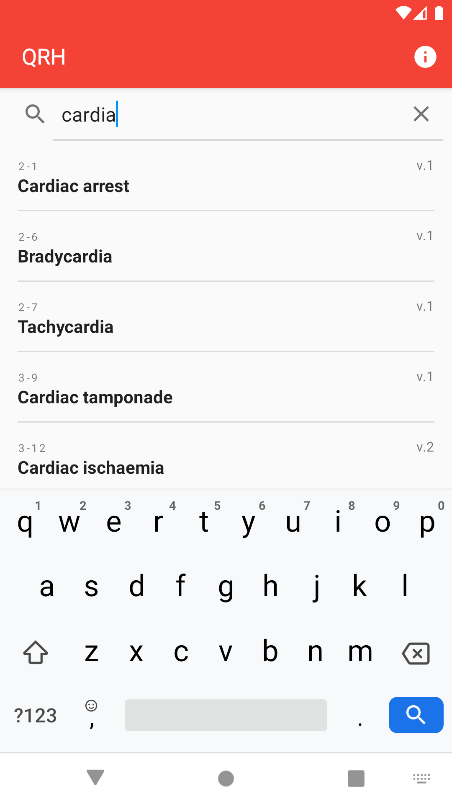
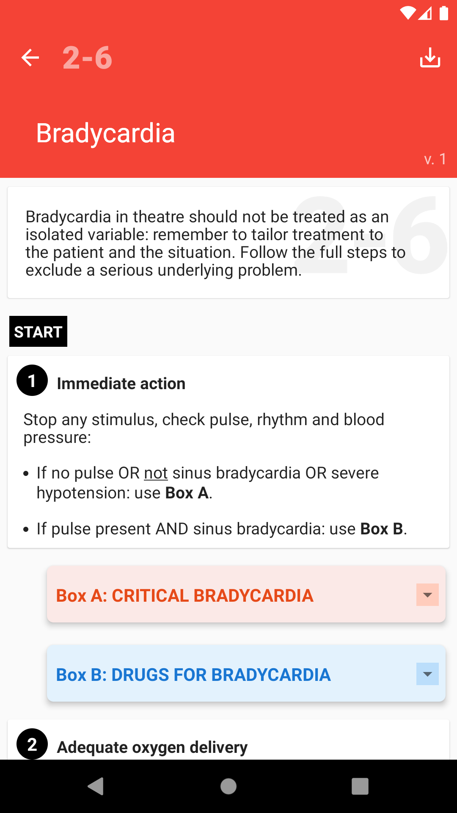
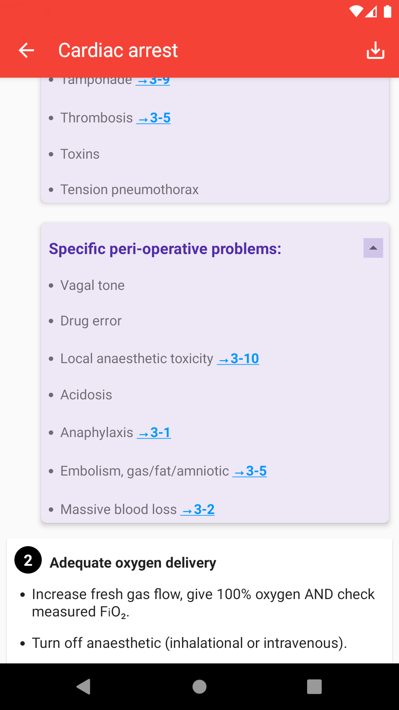
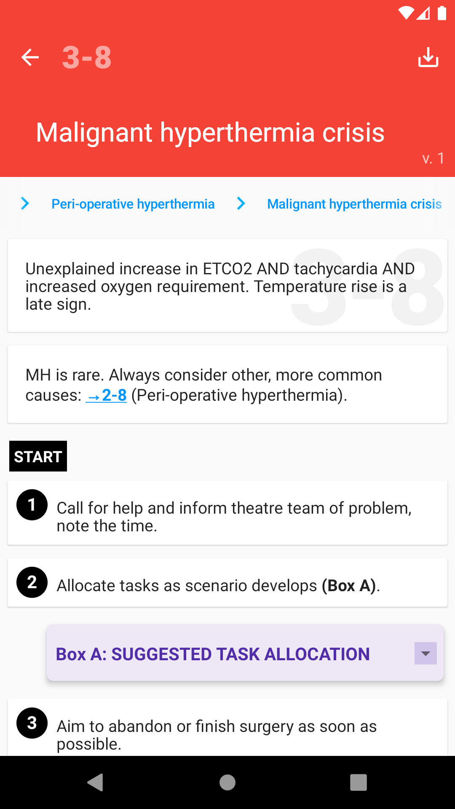
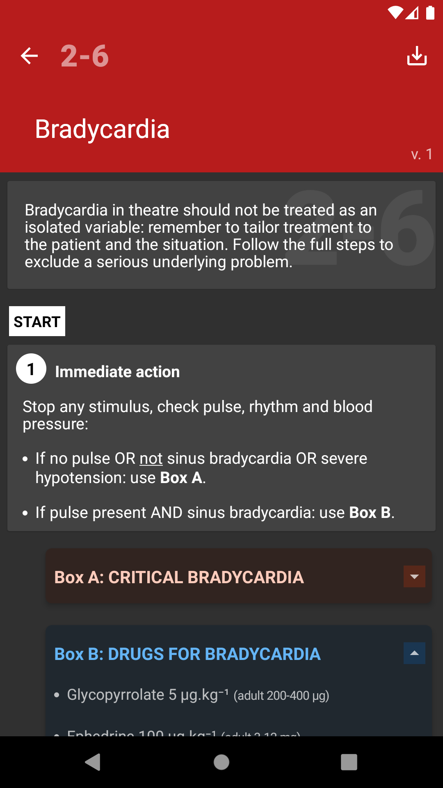
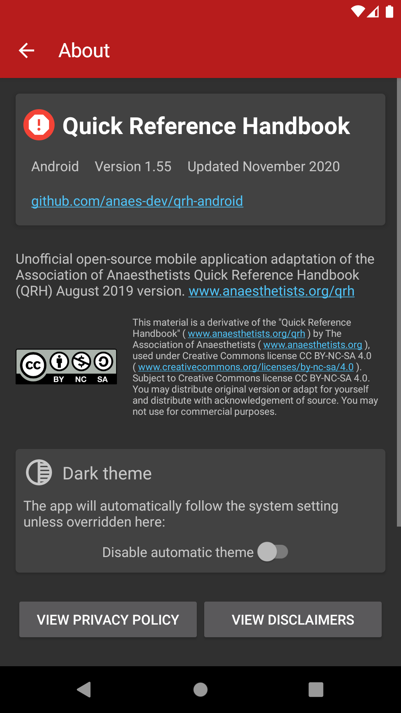

# Quick Reference Handbook (QRH)

      

      

## Features
- Unofficial derivative of the Association of Anaesthetists Quick Reference Handbook (QRH): www.anaesthetists.org/qrh (CC BY-NC-SA 4.0)
- ***Not endorsed by the Association of Anaesthetists***
- Rapidly searchable guideline list
- Simple guideline layout echoing original handbook
- Clickable links between guidelines with breadcrumbs
- Supports dark theme (Android Q and later)
- Easily updatable through modification of JSON assets
- [![CC BY-NC-SA 4.0][cc-by-nc-sa-shield]][cc-by-nc-sa] Released under same Creative Commons license as original work  
- iOS version available at github.com/anaes-dev/qrh-ios

This application has been neither professionally developed nor tested. It carries no certification markings, regulatory approvals or technical assessment appraisals. Please read full guidance and disclaimers on first launch.

## License
This work is licensed under a [Creative Commons Attribution-NonCommercial-ShareAlike 4.0
International License][cc-by-nc-sa].

[![CC BY-NC-SA 4.0][cc-by-nc-sa-image]][cc-by-nc-sa]

[cc-by-nc-sa]: http://creativecommons.org/licenses/by-nc-sa/4.0/
[cc-by-nc-sa-image]: https://licensebuttons.net/l/by-nc-sa/4.0/88x31.png
[cc-by-nc-sa-shield]: https://img.shields.io/badge/License-CC%20BY--NC%20SA%204.0-lightgrey.svg
You may distribute original version or adapt for yourself and distribute with acknowledgement of source. 
You may not use for commercial purposes.  

## Download

Available on Google Play:   

Otherwise please build from source or download APK from releases:
github.com/anaes-dev/qrh-android/releases

## Technical
*(For any updates, modifications or derivatives)*

The guideline list is generated from /assets/guidelines.json. 

Guidelines are stored as JSON objects in the assets folder.

Each array contains 'type', 'main', 'sub' and 'step' keys.

These populate different styled cards for each guideline page.

### Card views

Type integer value determines the appearance of the generated card:
1. Introductory text (main only)
2. START text (main only)
3. Guideline step with bold heading and separate content (main, sub and step)
4. Guideline step with single text field (main and step)
5. Orange expanding box (main and sub)
6. Blue expanding box (main and sub)
7. Green expanding box (main and sub)
8. Black expanding box (main and sub)
9. Purple expanding box (main and sub)
10. Image (path/URL in main, caption in sub)
11. Version text (main only)
12. Red disclaimer card (main only)  

### Card contents

Basic HTML tags (B, U, I, LI) can be used within for formatting where required. All tags should be closed, otherwise may lead to parsing errors. 

Unicode subscript and superscript characters are used rather than SUB and SUP spans due to line-height issues on earlier Android versions.

Links are parsed as following:

#### Guideline links
Generated when the following regex is matched:  
`/[(]?[→][\s]?[1-4][-][0-9]{1,2}[)]?/`  
Therefore can have with or without parentheses, and is insensitive to space between → and guideline code.

#### Phone links
Generated from 11 digit numbers beginning with 0

#### Web links
URLs beginning with http(s):// or www.  
  
*Google Play and the Google Play logo are trademarks of Google LLC.*
